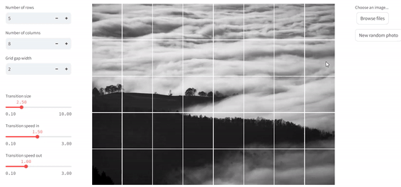

# Organic Grids App

A playful [web application](https://organic-grids-app.streamlit.app/) that creates an interactive grid effect from randomly fetched and uploaded images. Built with Streamlit.

[//]: # (Add a GIF or screenshot of the effect here)

## About

This app splits uploaded images into a customizable grid and applies a hover effect that creates an engaging visual experience. The tiles smoothly transition in size when hovered over, creating an interesting visual effect.

Inspired by the work of [Nahuel Gerth](https://github.com/NahuelGerthVK).

## Features

- Upload your own images or start with a random one
- Customize grid dimensions and transition effect
- Smooth hover transitions

## Try It Out

The app is deployed at: [organic-grids-app.streamlit.app](https://organic-grids-app.streamlit.app/)

## Built With

- Python
- Streamlit
- CSS for transitions

## Just for Fun

This project was created as a fun exercise in Streamlit development, image manipulation and CSS transitions. Feel free to play around with it!
